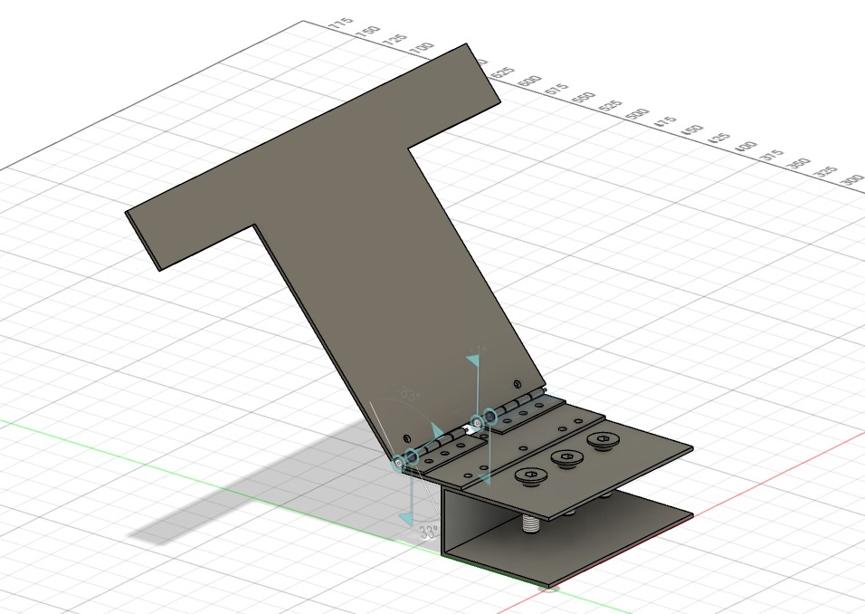

# DSHOT-based ESC Control with MPU6050 and PID Feedback for ESP32

This project implements a control system for Electronic Speed Controllers (ESCs) using the DSHOT protocol on an ESP32-based platform. The system reads pitch and roll angles from an MPU6050 sensor and adjusts the ESC throttle using a PID control loop. The PID controller helps stabilize the angle of a moving platform by dynamically controlling the ESC throttle.

---

## Table of Contents

1. [Description](#description)
2. [Key Features](#key-features)
3. [Hardware Requirements](#hardware-requirements)
4. [Software Requirements](#software-requirements)
5. [Project Workflow](#project-workflow)
6. [Contributors](#contributors)
7. [Acknowledgements](#acknowledgements)
8. [Resources](#resources)

---

## Description

We have developed an advanced Morphobot capable of operating in multiple configurations: rover mode, drone mode, and a semi-drone hybrid mode. Its unique design offers significant advantages, particularly in applications where access is difficult or dangerous for humans, such as in confined or hazardous environments. This is made possible due to its structural flexibility, enabling it to adapt to a variety of terrains and challenges.

To test this concept, we utilized a T-shaped laser-cut aluminum plate as the core structure for our prototype. This plate was hinged to a fixed support, restricting its movement to a single axis for more controlled experimentation. Two BLDC (Brushless DC) motors were mounted at the ends of the plate, providing the necessary thrust, while additional equipment was mounted centrally to ensure even weight distribution.

Our initial focus was on determining the take-off throttle—i.e., the throttle value at which the plate would lift off. After several trials, we derived a mathematical equation correlating the angle of the plate relative to the base and the corresponding throttle required to achieve and maintain that angle. Following this theoretical work, we conducted practical experiments to measure the actual throttle values and the resulting angles achieved by the Morphobot in real-world conditions.

The next phase of our project involves comparing these real-world throttle readings with the theoretical values calculated previously. By dividing the theoretical throttle values by the real throttle values, we aim to identify a correction factor that accounts for discrepancies between theory and practice. Once we establish this correction factor, we plan to integrate it into the PID balancing code. This will allow us to finely control the Morphobot, ensuring it can balance itself at any given angle—up to 180 degrees—based on real-time feedback. 

Our goal is to enhance the Morphobot's precision and stability, making it a versatile tool for various applications in environments where human intervention is either impractical or unsafe.

---

## Key Features
- **DSHOT Protocol**: The project uses the DSHOT300 protocol to communicate with ESCs, providing high precision and robustness.
- **PID Control**: Implements a Proportional-Integral-Derivative (PID) controller to adjust the ESC throttle based on the pitch angle from the MPU6050 sensor.
- **MPU6050 Sensor**: The project reads Euler angles (pitch and roll) from the MPU6050, used as feedback for the PID controller.
- **FreeRTOS Integration**: Uses FreeRTOS tasks for handling sensor readings and ESC control simultaneously.
- **Graph Plotting Queue**: Includes a mechanism for sending PID terms and pitch correction data to a queue for potential real-time graph plotting.

---

## Hardware Requirements

- **ESP32/ESP32H2** microcontroller
- **MPU6050** accelerometer and gyroscope sensor
- **DSHOT-capable ESCs**
- **RMT capable GPIO pins** (used for DSHOT signal generation)
  - GPIO 15 for ESC1
  - GPIO 2 for ESC2
- **Motors connected to the ESCs**

---

## Software Requirements

- **ESP-IDF** (Espressif IoT Development Framework)
- **FreeRTOS** (Real-Time Operating System for embedded devices)
- **DSHOT ESC encoder library**

---

## Project Workflow:

- Studied the essential concepts of linear algebra required for implementing a self-balancing mechanism.
- Explored the principles and tuning strategies of PID (Proportional-Integral-Derivative) control systems to manage angular stability.
- Adapted the ESP-IDF RMT (Remote Control) protocol to drive two BLDC motors with precise throttle control for real-time stabilization.
- Integrated the MPU6050 IMU sensor to obtain continuous angle feedback, enabling responsive control input.
- Developed a WebSocket-based web server to dynamically send and receive PID parameters, allowing real-time tuning and monitoring.
- Derived and implemented a correction factor to minimize deviations between theoretical predictions and actual results.
- Currently calibrating the system by mapping throttle values to angular positions and verifying the model through practical experimentation and refining the hardware and structure of the plate to be able to balance it more effectively.

---

## Contributors
-- [Ameya](https://github.com/AmeyaTikhe)

-- [Kesar](https://github.com/MasterQueen16)

-- [Soham](https://github.com/sohamukute)

-- [Atharva](https://github.com/AtharvaKhare1/)

---

## Acknowledgements
 Special thanks to our Mentors
 
-- [Shankari](https://github.com/Shankari02)

-- [Atharva](https://github.com/RapidRoger18)

---

## Resources
* [Linear Algebra playlist by 3Blue1Brown](https://www.youtube.com/playlist?list=PL0-GT3co4r2y2YErbmuJw2L5tW4Ew2O5B)
* [Understanding PID Control by MATLAB](https://www.youtube.com/playlist?list=PLn8PRpmsu08pQBgjxYFXSsODEF3Jqmm-y)
* [ESP-IDF official repository](https://github.com/espressif/esp-idf)
* [ESP-IDF documentation](https://docs.espressif.com/projects/esp-idf/en/latest/esp32/)
